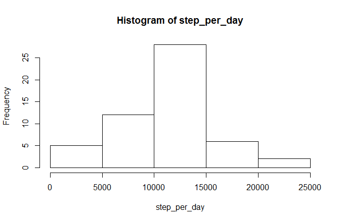
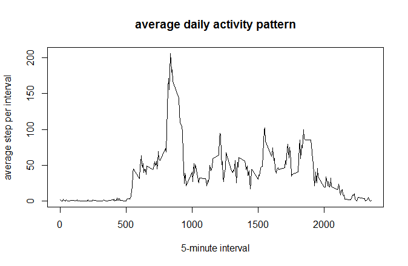
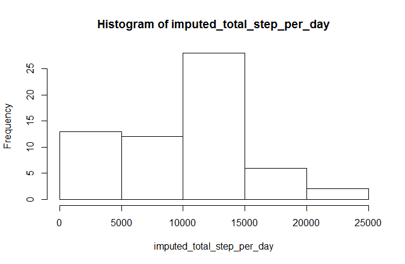
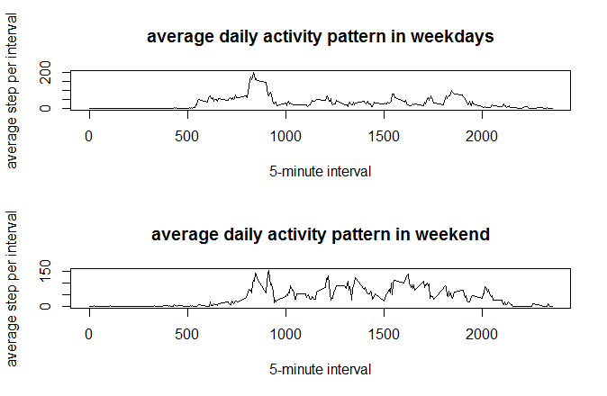

<br>

1. Loading and preprocessing the data

1.1 Load the data (i.e. read.csv())


```r
setwd("C:/")
activity <- read.csv("activity.csv")
```


1.2 Process/transform the data into a format suitable for your analysis


```r
activity$hour <- activity$interval%/%100
activity$minute <- activity$interval%%100
activity$time <- paste(activity$hour, activity$minute)

activity$datetime <- paste(activity$date, activity$time)
activity$datetime <- strptime(activity$datetime, format = "%Y-%m-%d %H %M")

str(activity)
```

```
## 'data.frame':	17568 obs. of  7 variables:
##  $ steps   : int  NA NA NA NA NA NA NA NA NA NA ...
##  $ date    : Factor w/ 61 levels "2012-10-01","2012-10-02",..: 1 1 1 1 1 1 1 1 1 1 ...
##  $ interval: int  0 5 10 15 20 25 30 35 40 45 ...
##  $ hour    : num  0 0 0 0 0 0 0 0 0 0 ...
##  $ minute  : num  0 5 10 15 20 25 30 35 40 45 ...
##  $ time    : chr  "0 0" "0 5" "0 10" "0 15" ...
##  $ datetime: POSIXlt, format: "2012-10-01 00:00:00" "2012-10-01 00:05:00" ...
```

<br>

2. What is mean total number of steps taken per day?

2.1 Calculate the total number of steps taken per day


```r
step_per_day <- tapply(activity$steps, activity$date, sum)
```

2.2 If you do not understand the difference between a histogram and a barplot, research the difference between them.
Make a histogram of the total number of steps taken each day


```r
hist(step_per_day)
```



2.3 Calculate and report the mean and median of the total number of steps taken per day


```r
steps <- data.frame(step_per_day) 

mean(steps$step_per_day, na.rm = TRUE)
```

```
## [1] 10766.19
```

```r
median(steps$step_per_day, na.rm = TRUE)
```

```
## [1] 10765
```

<br>

3. What is the average daily activity pattern?

3.1 Make a time series plot (i.e. type = "l") of the 5-minute interval (x-axis) 
and the average number of steps taken,averaged across all days (y-axis)


```r
avg_step_per_interval <- tapply(activity$steps, activity$interval, mean, na.rm = TRUE)
df.avg_step_per_interval <- data.frame(avg_step_per_interval)
df.avg_step_per_interval$interval <- row.names(df.avg_step_per_interval)
```


```r
plot(df.avg_step_per_interval$interval, df.avg_step_per_interval$avg_step_per_interval, 
     type = "l", xlab = "5-minute interval", ylab = "average step per interval",
     main = "average daily activity pattern")
```




3.2 Which 5-minute interval, on average across all the days in the dataset, contains the maximum number of steps?


```r
df.avg_step_per_interval[which.max(df.avg_step_per_interval$avg_step_per_interval),]$interval
```

```
## [1] "835"
```

<br>

4. Imputing missing values
Note that there are a number of days/intervals where there are missing values. 
The presence of missing days may introduce bias into some calculations or summaries of the data.

4.1 Calculate and report the total number of missing values in the dataset 
(i.e. the total number of rows with NAs) Devise a strategy for filling in all 
of the missing values in the dataset. The strategy does not need to be sophisticated. 
For example, you could use the mean/median for that day, or the mean for that 
5-minute interval, etc.Create a new dataset that is equal to the original 
dataset but with the missing data filled in.

Calculate the total number of missing values in the dataset 


```r
sum(rowSums(is.na(activity)))
```

```
## [1] 2304
```


filling in missing values with average steps per interval

```r
imputed_activity <- merge(activity, df.avg_step_per_interval, by = 'interval')
imputed_activity$steps[is.na(imputed_activity$steps)] <- imputed_activity$avg_step_per_interval
```

```
## Warning in imputed_activity$steps[is.na(imputed_activity$steps)] <-
## imputed_activity$avg_step_per_interval: number of items to replace is not a
## multiple of replacement length
```

4.2 Make a histogram of the total number of steps taken each day and Calculate and report the mean and median total number of steps taken per day.
Do these values differ from the estimates from the first part of the assignment? 
What is the impact of imputing missing data on the estimates of the total daily number of steps?


```r
imputed_total_step_per_day <- tapply(imputed_activity$steps, imputed_activity$date, sum, na.rm = T)
```


```r
hist(imputed_total_step_per_day)
```




```r
max(imputed_total_step_per_day)
```

```
## [1] 21194
```
the mean total number of steps taken per day is "21194" 


```r
median(imputed_total_step_per_day)
```

```
## [1] 10395
```
the median total number of steps taken per day is "10395"

<br>

5. Are there differences in activity patterns between weekdays and weekends?
For this part the weekdays() function may be of some help here. 
Use the dataset with the filled-in missing values for this part.

5.1 Create a new factor variable in the dataset with two levels ?€? ?€œweekday?€? 
and ?€œweekend?€? indicating whether a given date is a weekday or weekend day.

```r
Sys.setlocale("LC_TIME", "English")
```

```
## [1] "English_United States.1252"
```

```r
imputed_activity$weekday <- weekdays(as.Date(imputed_activity$date))
weekdays1 <- c('Monday', 'Tuesday', 'Wednesday', 'Thursday', 'Friday')
imputed_activity$weekday_factor <- factor((imputed_activity$weekday %in% weekdays1), 
                   levels=c(FALSE, TRUE), labels=c('weekend', 'weekday'))
```

Make a panel plot containing a time series plot (i.e. type = "l") of 
the 5-minute interval (x-axis) and the average number of steps taken, 
averaged across all weekday days or weekend days (y-axis). 


```r
weekdays_activity <- subset(imputed_activity, subset = (weekday_factor == "weekday"))
weekends_activity <- subset(imputed_activity, subset = (weekday_factor == "weekend"))

weekdays_avg_step_per_interval <- tapply(weekdays_activity$steps, weekdays_activity$interval, mean, na.rm = TRUE)
weekends_avg_step_per_interval <- tapply(weekends_activity$steps, weekends_activity$interval, mean, na.rm = TRUE)

df.weekdays_avg_step_per_interval <- data.frame(weekdays_avg_step_per_interval)
df.weekends_avg_step_per_interval <- data.frame(weekends_avg_step_per_interval)

df.weekdays_avg_step_per_interval$interval <- row.names(df.weekdays_avg_step_per_interval)
df.weekends_avg_step_per_interval$interval <- row.names(df.weekends_avg_step_per_interval)
```


```r
par(mfrow=c(2,1))
plot(df.weekdays_avg_step_per_interval$interval, df.weekdays_avg_step_per_interval$weekdays_avg_step_per_interval, 
     type = "l", xlab = "5-minute interval", ylab = "average step per interval",
     main = "average daily activity pattern in weekdays")

plot(df.weekends_avg_step_per_interval$interval, df.weekends_avg_step_per_interval$weekends_avg_step_per_interval, 
     type = "l", xlab = "5-minute interval", ylab = "average step per interval",
     main = "average daily activity pattern in weekend")
```


